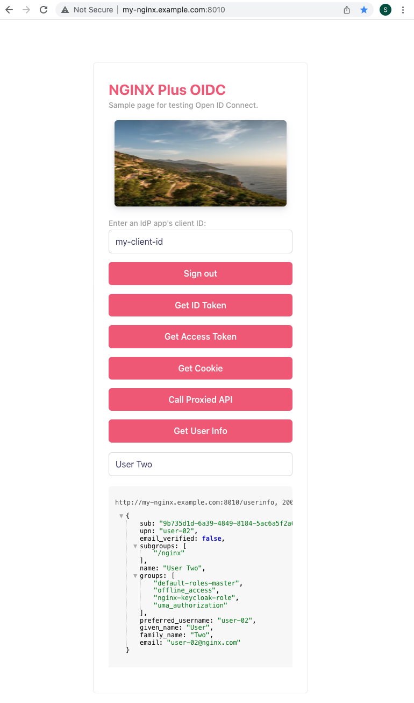

# Running NGINX Plus OIDC In Docker

This is to provide how to set up and test NGINX Plus OIDC in docker based on the examples of docker files, frontend and backend.

## Summary of Steps

| Category            | Details                                                                             |
| ------------------- | ----------------------------------------------------------------------------------- |
| 1. IdP Setup        | [Configure your IdP](#configure-idp)                                                |
| 2. Certs & License  | [Prepare Certs and NGINX Plus License](#prepare-certs-and-nginx-plus-license)       |
| 3. NGINX Plus Setup | [Configure Frontend Site and Backend App](#configure-frontend-site-and-backend-app) |
|                     | [Modify OIDC Configuration](#modify-oidc-configuration)                             |
| 4. Docker Compose   | [Set Up and Run Docker Compose](#set-up-and-run-docker-compose)                     |
| 5. NGINX OIDC Test  | [Test NGINX Plus OIDC RP Implementation](#test-nginx-plus-oidc-rp-implementation)   |

## Configure your IdP

Find the following guidelines how to configure your IdP.

- [GitHub: NGINX Plus OIDC](https://github.com/nginxinc/nginx-openid-connect/#configuring-your-idp)
  > Note that this docker-compose based test doesn't use `configure.sh`.
- [NGINX Doc: Enabling Single Sign-on for Proxied Applications w/ NGINX Plus](https://docs.nginx.com/nginx/deployment-guides/single-sign-on/)

## Prepare Certs and NGINX Plus License

Create your certificates for SSL, and download NGINX Plus license files.

> Note that you can test this NGINX Plus OIDC without certs. But we suggest that you configure them in your production.

**Certificates**:

Create your certificates, and copy the files into the following path if you enable SSL.

- [**Path**](./build-context/ssl): `build-context/ssl`
- **Files**: `my-sample.crt`, `my-sample.key`
- Uncomment the following lines in [`Dockerfile`](./docker-files/nginxplus-ubuntu18.04/Dockerfile)
  ```bash
  #COPY etc/ssl/my-nginx.example.com.crt /etc/ssl/my-nginx.example.com.crt
  #COPY etc/ssl/my-nginx.example.com.key /etc/ssl/my-nginx.example.com.key
  ```

**NGINX Plus License:**

Download the NGINX Plus license files via the [F5/NGINX customer portal](https://cs.nginx.com/?_ga=2.268586425.912746048.1620625839-85838359.1596947109), and copy the files into the following path.

- [**Path**](./build-context/ssl): `build-context/ssl`
- **Files**: `nginx-repo.crt`, `nginx-repo.key`

## NGINX Plus Setup

Modify frontend/backend and OIDC configuration with NGINX Plus via [this link](https://github.com/shawnhankim/nginx-openid-connect#configuring-nginx-plus) in detail.

### Configure Frontend Site and Backend App

- Configure your frontend site and backend app in [`oidc_frontend_backend.conf`](../oidc_frontend_backend.conf).
- The guideline is described in [this link](https://github.com/shawnhankim/nginx-openid-connect#configuring-nginx-plus).
  > Note that you can test the sample of protected frontend site and backend app based on NGINX OIDC without modifying the file in this repository for your convenience.
- Edit `/etc/hosts` file with the server name in your local machine like:
  ```
  127.0.0.1      my-nginx.example.com  # host name of sample frontend site
  127.0.0.1      host.docker.internal  # host name of docker container for local Keycloak testing
  ```

### Modify OIDC Configuration

- Review the following files and manually configure them with mathching your IdP(s) configuration.

  | File                                                | Remark                                             |
  | --------------------------------------------------- | -------------------------------------------------- |
  | [oidc_idp.conf](../oidc_idp.conf)                   | IdP Configuration for OIDC                         |
  | [oidc_nginx_http.conf](../oidc_nginx_http.conf)     | NGINX Configuration in http block for OIDC         |
  | [oidc_nginx_server.conf](../oidc_nginx_server.conf) | NGINX Configuration in server block for OIDC       |
  | [oidc.js](../oidc.js)                               | Performing OIDC workflow. No changes are required. |

- The guideline is described in [this link](https://github.com/shawnhankim/nginx-openid-connect#configuring-nginx-plus).

## Set Up and Run Docker Compose

Set up your local environment for testing OIDC workflows based on NGINX Plus docker container as follows.

- [Install Docker Compose](https://docs.docker.com/compose/install/)
- **Create a Docker image called `nginx-plus-oidc`**:

  ```
  $ docker-compose build --no-cache
  ```

- **Clean out old images and volumes** if you want:

  - Option 1:
    ```
    $ docker system prune -a && \
      docker volume rm $(docker volume ls -qf dangling=true)
    ```
  - Option 2:
    ```
    $ make clean
    ```

- **Run a Docker container based on the image:**
  This is to locally edit files and reload `nginx -s reload` for your convenient testing in container(s).

  - Option 1:
    ```bash
    $ docker-compose up -d
    ```
  - Option 2:
    ```bash
    $ make start
    ```

- **Execute the following command if you want to stop the container:**
  - Option 1:
    ```bash
    $ docker-compose down
    ```
  - Option 2:
    ```bash
    $ make down
    ```

## Test NGINX Plus OIDC RP Implementation

For your convenience, you could use the following test tool in the main web page. It can be used as for now if you sign-in via OIDC. The login process is going to be additionally added and revised.

- Access your frontend page (For example, `http://my-nginx.example.com:8010/`) via your web browser.
- Sample frontend page as a OIDC test tool
  - The default client ID is `my-client-id` in the example of this repo.
  - You could set your IdP app's client ID before signing-in.
    
