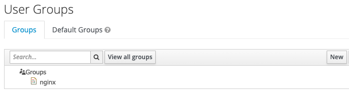

# How To Customize Tokens With Groups Claim

**Table Of Contents:**

- [Okta Custom Claim Setup](#okta-custom-claim-setup)
- [Keycloak Custom Claim Setup](#keycloak-custom-claim-setup)

## Okta Custom Claim Setup

- Add group (i.e. `nginx`):

  

- Assign people to the group:

  

- Assign application to the group:

  

- Edit `Groups claim` in your app (i.e. `my-nginx-plus-pkce`):

  

  - Navigate to `Admin > Applications > OpenID Connect application > Sign On tab > OpenID Connect ID Token`
  - Select Edit, switch Groups claim type to `"Expression"` and, below, add a claim name (for example "groups") and paste the following, changing active_directory to the specific variable copied earlier from Profile Editor.
    ```
    Arrays.isEmpty(Arrays.toCsvString(Groups.startsWith("active_directory","",100))) ? Groups.startsWith("OKTA","",100) : Arrays.flatten(Groups.startsWith("OKTA","",100),Groups.startsWith("active_directory","",100))
    ```

- Configure if you want to use a custom authorization server:

  - Navigate to `Admin > Security (omit this step if using the Developer Console Interface) > API`, and check the following:

    

  - Navigate to `Admin > Security (omit this step if using the Developer Console Interface) > API > Authorization Servers > Your authorization server > Claims tab`

  - Add a new claim, with the following properties:

    

    - Name: `subgroups` (or any other name to identify the claim)
    - Include in token type: `Access Token or ID Token`
    - Value type: `Expression`
    - Value: the expression above that is used also in Okta authorization server, modifying active_directory to the specific variable copied earlier from Profile Editor
    - Disable claim: leave unchecked
    - Include in: Any scope

- Get well-known endpoints from the `Metadata URI`:

  

- Edit `oidc_idp.conf`:

  ```nginx
  map $x_client_id $oidc_authz_endpoint {
      0oa1u2c1p0QgIiGKX5d7    $oidc_host/oauth2/default/v1/authorize;
  }

  map $x_client_id $oidc_jwt_keyfile {
      0oa1u2c1p0QgIiGKX5d7    $oidc_host/oauth2/default/v1/keys;
  }

  map $x_client_id $oidc_logout_endpoint {
      0oa1u2c1p0QgIiGKX5d7    $oidc_host/oauth2/default/v1/logout;
  }

  map $x_client_id $oidc_token_endpoint {
      0oa1u2c1p0QgIiGKX5d7    $oidc_host/oauth2/default/v1/token;
  }

  map $x_client_id $oidc_userinfo_endpoint {
      0oa1u2c1p0QgIiGKX5d7    $oidc_host/oauth2/default/v1/userinfo;
  }
  ```

- Check if `subgroups` exist in access token after successful log-in:
  ```json
  {
    "subgroups": ["Everyone", "nginx"]
  }
  ```

## Keycloak Custom Claim Setup

- Create a user group:

  

- Add a user, and assign it to the group:

  

- Crete a protocol mapper:

  

  

- Check if `subgroups` exist in access token after successful log-in:

  ```json
  {
    "subgroups": ["/nginx"]
  }
  ```

## Reference

- [Customize tokens returned from Okta with a Groups claim](https://developer.okta.com/docs/guides/customize-tokens-groups-claim/main/)
- [How to retrieve both Active Directory and Okta groups in OpenID Connect claims?](https://support.okta.com/help/s/article/Can-we-retrieve-both-Active-Directory-and-Okta-groups-in-OpenID-Connect-claims?language=en_US&_ga=2.217155987.46055333.1643827737-791517745.1643827737)
