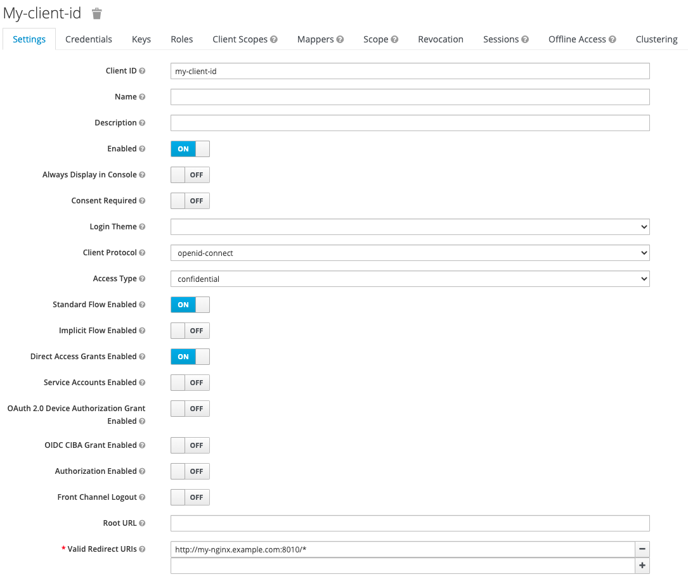

# Keycloak Configuration

- [Configuring Keycloak](#configuring-keycloak)
- [Configuring NGINX Plus](#configuring-nginx-plus)
- [Misc.](#misc.)

## Configuring Keycloak

You could find [how to configure Keycloak in NGINX Docs](https://docs.nginx.com/nginx/deployment-guides/single-sign-on/keycloak/) in detail. Recently, this repo has been enhanced with `/logout` endpoint. In order for IdP to redict to the endpoints (For example, `/_codexch`, `/_logout`) of NGINX Plus after successful authentication or logout, you could set `http://my-nginx.example.com:8010/*` into the section of `Valid Redirect URIs` of Keycloak UI as follows.

**Note**: The following Keycloak GUI at the time of publication is subject to change. Use this guide as a reference and adapt to the current Keycloak GUI as necessary.



## Configuring NGINX Plus

Use the following files in this directory as references and modify them as necessary.

- `oidc_idp.conf` in `/etc/nginx/conf.d/`
- `oidc_nginx_server.conf` in `/etc/nginx/conf.d/`

<br>

## Misc.

- Add the followings into `/etc/hosts` file before running `docker-compose up` for your local testing.
  ```
  127.0.0.1      host.docker.internal
  127.0.0.1      my-nginx.example.com
  ```
